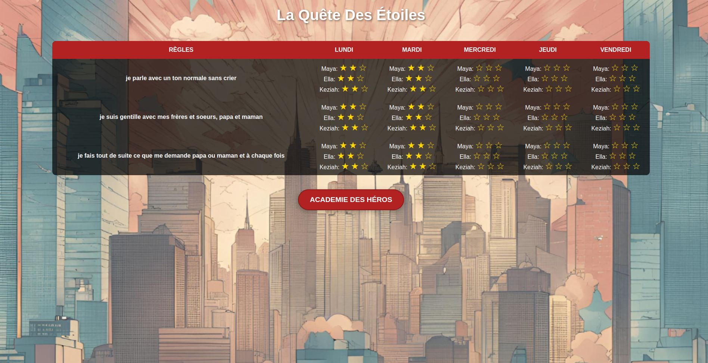
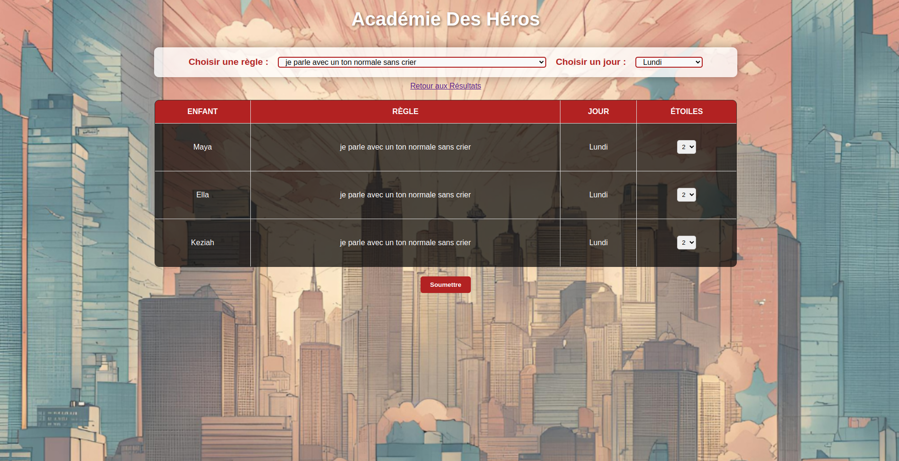

# Project Presentation: StarHeroes

Welcome to **StarHeroes**! 🌟

StarHeroes is a fun and engaging web app designed for kids to track their achievements and earn shining stars! Each week, children can showcase their awesome behavior and complete tasks, collecting stars along the way. Parents can easily customize rules, give feedback, and celebrate their little heroes' progress with colorful charts and reports.

Join us on this exciting journey where every child becomes a StarHero, shining bright with every accomplishment! Let’s make learning and growing a joyful adventure! 🚀✨

## Tasks

# Backlog Produit - StarHeroes

## Sprint 1 : Mise en place des fonctionnalités de base

| **ID** | **Tâche**                                    | **Description**                                              | **Estimation (jours)** | **Definition of Done (DoD)**                                 | **Statut** |
| ------ | -------------------------------------------- | ------------------------------------------------------------ | ---------------------- | ------------------------------------------------------------ | ---------- |
| 1      | Interface utilisateur intuitive (Calendrier) | Implémenter le calendrier hebdomadaire pour suivre le comportement des enfants. | 2 jours                | - L'interface affiche un calendrier avec les jours de la semaine.  - Chaque enfant a une colonne dédiée.  - Le calendrier est fonctionnel et responsive. | Done       |
| 2      | Système de notation par étoiles              | Permettre de noter les enfants avec 5 étoiles pour chaque jour de la semaine. | 2 jours                | - Le système de notation par étoiles fonctionne pour chaque jour de la semaine.  - Les notes sont sauvegardées dans la base de données.  - Le formulaire de notation est accessible uniquement pour les parents.  | Done       |
| 5      | Authentification                             | Implémenter un système d'authentification simple pour les parents. | 1 jour                 | - Les parents peuvent se connecter à l’application via un login et mot de passe.  - Les enfants n’ont pas accès aux fonctions d’évaluation.  - Le code est sécurisé, testé et validé. | Done       |
| 6      | Base de données (SQLite)                     | Mise en place d'une base de données SQLite pour stocker les informations. | 1 jour                 | - La base de données SQLite est connectée à l'application.  - Les informations des enfants (noms, scores) sont stockées et récupérables.  - Les tests de base de données sont passés avec succès. | Done       |

## Sprint 2 : Ajout des fonctionnalités avancées

| **ID** | **Tâche**                                             | **Description**                                                                 | **Estimation (jours)** | **Definition of Done (DoD)**                                                                                                                                                                  | **Statut**          |
|--------|--------------------------------------------------------|---------------------------------------------------------------------------------|------------------------|------------------------------------------------------------------------------------------------------------------------------------------------------------------------------------------------|---------------------|
| 3      | Gestion des règles                                      | Permettre d'ajouter, modifier et supprimer des règles pour évaluer les enfants.  | 2 jours                | - Les parents peuvent ajouter, modifier et supprimer des règles dans l’application.  - Les règles sont sauvegardées dans la base de données et appliquées chaque semaine.  - L’interface utilisateur est intuitive et facile à utiliser.  - Le code est testé et fonctionnel. | À faire             |
| 4      | Visualisation des résultats                            | Implémenter une représentation graphique des performances (barres, camembert).   | 2 jours                | - Les performances des enfants sont représentées sous forme de graphiques (barres, camembert, etc.).  - Les graphiques se mettent à jour automatiquement en fonction des notes.  - L’interface est responsive et fonctionne sur tous les appareils.  - Les tests visuels et fonctionnels sont passés. | À faire             |
| 8      | Intégration d'OpenAPI et documentation                 | Documenter les routes d'API avec Flask-RESTPlus et générer Swagger UI.           | 1 jour                 | - Les routes de l'API sont documentées dans Swagger UI.  - La documentation OpenAPI est générée automatiquement via Flask-RESTPlus.  - L'API est testée via Swagger UI et fonctionne comme prévu.  - Les tests unitaires pour l'API sont réalisés. | À faire             |
| 7      | Docker & Docker Compose                                | Conteneuriser l'application avec Docker et Docker Compose.                       | 2 jours                | - L'application fonctionne correctement dans un conteneur Docker.  - Docker Compose permet de démarrer l’application et la base de données en une seule commande.  - Les tests d'intégration sont effectués avec succès dans les conteneurs.  - Le fichier `docker-compose.yml` est correctement configuré et versionné. | À faire             |

## Sprint 3 : Fonctionnalités supplémentaires et optimisation

| **ID** | **Tâche**                                             | **Description**                                                                 | **Estimation (jours)** | **Definition of Done (DoD)**                                                                                                                                                                  | **Statut**          |
|--------|--------------------------------------------------------|---------------------------------------------------------------------------------|------------------------|------------------------------------------------------------------------------------------------------------------------------------------------------------------------------------------------|---------------------|
| 9      | Notifications (optionnel)                              | Mettre en place un système de notifications pour les comportements exceptionnels.| 1 jour                 | - Les notifications sont envoyées par email ou SMS en fonction de comportements exceptionnels ou de rappels.  - Les parents peuvent activer/désactiver les notifications.  - Les notifications sont fiables et sans erreurs.  - Les tests unitaires sont passés pour la fonctionnalité. | À faire             |
| 10     | Rapports personnalisés                                 | Générer des rapports sur les performances des enfants sur une période donnée.    | 2 jours                | - Les rapports hebdomadaires ou mensuels des performances des enfants peuvent être générés au format PDF ou Excel.  - Les rapports peuvent être consultés et envoyés par email.  - Le code est testé et fonctionne sans bugs.  - Les tests de génération de rapports sont réussis. | À faire             |
| 11     | Design responsive                                      | Adapter l'interface pour un affichage optimal sur smartphone et tablette.        | 2 jours                | - L’interface utilisateur s’adapte parfaitement à tous les types d’écrans (ordinateurs, tablettes, smartphones).  - Le design est fluide et les composants réactifs fonctionnent correctement.  - Les tests sur différents appareils et navigateurs sont validés. | À faire             |
