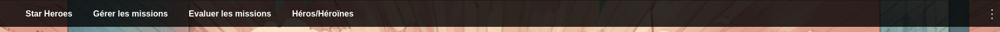
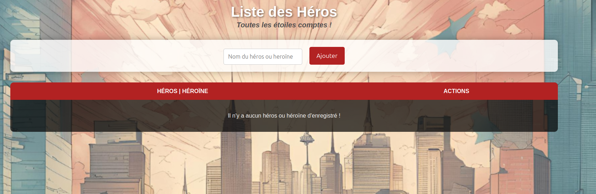

# Project Presentation: StarHeroes

Welcome to **StarHeroes**! 🌟

StarHeroes is a fun and engaging web app designed for kids to track their achievements and earn shining stars! Each week, children can showcase their awesome behavior and complete tasks, collecting stars along the way. Parents can easily customize rules, give feedback, and celebrate their little heroes' progress with colorful charts and reports.

Join us on this exciting journey where every child becomes a StarHeroes, shining bright with every accomplishment! Let’s make learning and growing a joyful adventure! 🚀✨








## How to Launch the Application

To successfully run this application, you need to follow these steps:
Prerequisites

Ensure you have the following installed on your machine:

* Docker
* Docker Compose

### Step 1: Create a `.env` File

Before launching the application, you need to create a `.env` file in the root directory of the project. This file will hold important configuration settings, including default admin credentials and the Flask environment mode.

Here’s a template for your `.env` file:

```properties
DEFAULT_ADMIN_NAME=xxxx
DEFAULT_ADMIN_EMAIL=xxx@xxx.xxxx
DEFAULT_ADMIN_PASSWORD=xxxxx

FLASK_ENV=development
```

Replace the placeholder values (`xxxx`, `xxx@xxx.xxxx`, and `xxxxx`) with your desired admin username, email, and password.

### Step 2: Build and Start the Application

Once the `.env` file is created, you can launch the application using Docker. Open your terminal, navigate to the project directory (where `docker-compose.yml` is located), and run the following command:

```shell
docker-compose up --build
```

This command will:

- Build the Docker images as defined in your `docker-compose.yml` file.
- Start the application services.

### Step 3: Access the Application

After the containers have started, you can access the application in your web browser at:

:eyes: http://localhost:5000

### Step 4: Stopping the Application

To stop the application, you can simply press `Ctrl + C` in the terminal where the application is running. Alternatively, you can run:

```shell
docker-compose down
```

This command will stop and remove the containers.

### Conclusion

You are now ready to use the application! If you encounter any issues, ensure that your `.env` file is correctly configured and that all required services are running.

# 👊 Contribution


Contributions are welcome! If you'd like to contribute, please follow these steps:

1. **Fork the repository** to your own GitHub account.
2. **Clone your fork** locally:

```
git clone https://github.com:<your username>/StarHeroes.git
cd StarHeroes
```

​    

**Create a new branch** for your feature or bug fix:

```
git checkout -b my-new-feature
```

​    

**Make your changes** and commit them with a clear message:

```
git commit -m "Add new feature"
```

​    

**Push your branch** to your fork:

1. ```
   git push origin my-new-feature
   ```

   ​    

1. **Open a Pull Request** on the original repository and describe your changes.

By following these steps, you can help improve the project for everyone!
